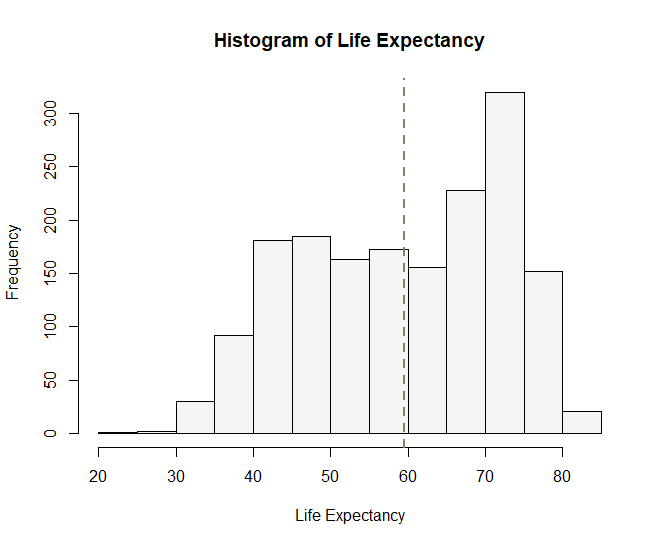

# R 기본 그래프

Base 함수들 중 자주 쓰는 것들은 다음과 같습니다: `plot()`, `hist()`, `barplot()`그리고 `boxplot()`. 이 함수들을 사용하여 **`gapminder`** 데이터를 다양하게 시각화해 봅시다. 

```r
# plot() : 변수들 간 관계를 한 눈에 볼 수 있는 이변량 그래프 그리기 (산점도; scatterplot) 
plot(gapminder)
```


예) 기대수명이 증가할수록 인구는 어떻게 변화할까요? x축은 lifeExp, y축은 pop의 값들을 산점도로 그려 표현한 것이 바로 5행 4열에 있는 그래프입니다. 패턴을 보니 lifeExp 변수와 pop 변수 간 양의 상관관계가 있습니다. 즉 기대수명이 높아질수록 인구는 증가하는 추세를 보입니다. 

이 두 변수 간 그래프를 확대해 볼까요? `plot(x축, y축)` 

```r
plot(gapminder$lifeExp, gapminder$pop) 

# options 추가 
plot(gapminder$lifeExp, gapminder$pop, col=gapminder$country, pch=19, 
     xlab="Life Expectancy", ylab="Population", 
		 main="Rcy and population")
```


연속형 변수의 빈도 분포를 살펴보는 데에는 `hist()` 함수를 사용합니다. 기대수명 변수의 히스토그램을 그려봅시다. 

```r
hist(gapminder$lifeExp)

# customize 
colors() # check available colors in R 
hist(gapminder$lifeExp, col="whitesmoke", 
		 xlab="Life Expectancy", main="Histogram of Life Expectancy")
abline(v=mean(gapminder$lifeExp), col="wheat4", lty=2, lwd=2) # add line
```



다음은 범주형 변수의 분포를 살펴보기에 좋은 `barplot()` 입니다. 각 대륙에 해당하는 값들이 몇 번 등장하는지를 시각화해봅시다. 

```r
table(gapminder$continent) # 빈도표 

# 빈도표 자체를 input으로 넣어서 barplot 그리기
barplot(table(gapminder$continent)) 

barplot(table(gapminder$continent), 
        col = c("lightblue", "mistyrose",
                "lightcyan", "lavender", "whitesmoke"),
        main = "Barplot")
```


마지막으로 범주형 변수 별로 연속형 변수의 분포를 살펴보기에 좋은 `boxplot()` 입니다. 각 대륙 별로 기대수명 분포를 시각화해봅시다. 

```r
boxplot(lifeExp ~ continent , data = gapminder) 

boxplot(lifeExp ~ continent , data = gapminder,
        col = c("lightblue", "mistyrose",
                "lightcyan", "lavender", "whitesmoke"),
        main = 'Boxplot',
        xlab = "Continent", 
        ylab = "Life Expectancy")
```


